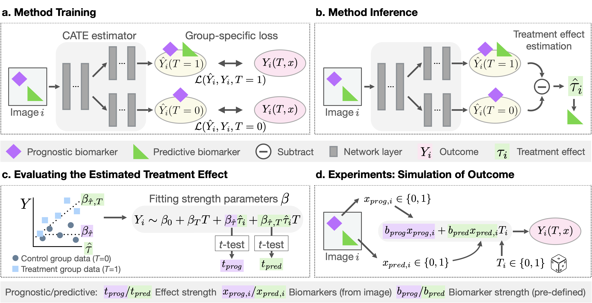

Copyright German Cancer Research Center (DKFZ), [Division of Medical Image Computing (MIC)](https://www.dkfz.de/en/mic/index.php) and contributors. Please make sure that your usage of this code is in compliance with its license [](https://github.com/MIC-DKFZ/predictive_image_biomarker_analysis/blob/main/LICENSE). 

# Enhancing predictive imaging biomarker discovery through treatment effect analysis

This repository contains the code of the paper [*"Enhancing predictive imaging biomarker discovery through treatment effect analysis"*](https://arxiv.org/abs/2406.02534v2). The code can be used to train and evaluate the performance of a conditional average treatment effect (CATE) estimation model in identifying **predictive imaging biomarkers**, i.e. specific image features that predict individual treatment responses.

<p align="center">
    
</p>
<p align="center">Overview of the proposed method for identifying predictive imaging biomarkers.</p>

**Abstract.**
*Identifying predictive covariates, which forecast individual treatment effectiveness, is crucial for decision-making across different disciplines such as personalized medicine. These covariates, referred to as biomarkers, are extracted from pre-treatment data, often within randomized controlled trials, and should be distinguished from prognostic biomarkers, which are independent of treatment assignment. Our study focuses on discovering predictive imaging biomarkers, specific image features, by leveraging pre-treatment images to uncover new causal relationships. Unlike labor-intensive approaches relying on handcrafted features prone to bias, we present a novel task of directly learning predictive features from images. We propose an evaluation protocol to assess a model's ability to identify predictive imaging biomarkers and differentiate them from purely prognostic ones by employing statistical testing and a comprehensive analysis of image feature attribution. We explore the suitability of deep learning models originally developed for estimating the conditional average treatment effect (CATE) for this task, which have been assessed primarily for their precision of CATE estimation while overlooking the evaluation of imaging biomarker discovery. Our proof-of-concept analysis demonstrates the feasibility and potential of our approach in discovering and validating predictive imaging biomarkers from synthetic outcomes and real-world image datasets.*

## Table of Contents

- [Installation](#installation)
- [Usage](#usage)
  - [Setting Environment Variables](#setting-environment-variables)
  - [Dataset Download](#dataset-download)
  - [Dataset Structure](#dataset-structure)
- [⚡Training](#⚡training)
- [📊Evaluation](#📊evaluation)
- [📑Citation](#📑citation)
- [Acknowledgements](#acknowledgements)


## Installation

To set up the environment, follow these steps:
1. Create a new conda environment:
```bash
conda create -n predimgbmenv python=3.9
conda activate predimgbmenv
```
2. Install the required Python packages:
```bash
pip install -r requirements.txt
```
3. Install the package:
```bash
python setup.py install
```

## Usage

### Setting Environment Variables
Set the necessary environment variables:
```bash
export DATASET_LOCATION=/absolute/path/to/datasets
export EXPERIMENT_LOCATION=/absolute/path/to/experiments
export CONFIGS_LOCATION=/absolute/path/to/configs
```
### Dataset Download
To reproduce the experiments in this repository, you will need to download the following datasets:
- [MNIST](http://yann.lecun.com/exdb/mnist/)
- [CUB-200-2011](https://www.vision.caltech.edu/datasets/cub_200_2011/)
- [ISIC 2018](https://challenge.isic-archive.com/data/#2018)
- [NSCLC Radiomics](https://www.cancerimagingarchive.net/collection/nsclc-radiomics/)

After downloading, make sure to place them in the directory specified by the environment variables (`$DATASET_LOCATION`).

### Dataset Structure
Ensure your dataset follows the required folder structure:
```bash
$DATASET_LOCATION               
├── MNIST      
├── CUB_200_2011 
│   └── CUB_200_2011 
└── ISIC2018   
│   ├── images
│   └── ...
└── NSCLC_Radiomics   
    ├── preprocessed_images_folder
    └── ...

```
To prepare the ISIC2018 dataset, copy all available images to a unified folder 'ISIC2018/images' using `cp $DATASET_LOCATION/ISIC2018_Task1-2*/* $DATASET_LOCATION/images`.

### ⚡Training

To reproduce the results from the paper and train image-based CATE estimation models, use the provided scripts for different datasets. Below are examples for each dataset:

**MNIST**:
```bash
runner_script_cmnist.sh hydra.job.name=miniresnetmtl_cmnista pl_params.model_type=miniresnetmtl pl_params.mode=mtl_loss pl_params.data_params.prog_feature=b_digitcircle pl_params.data_params.pred_feature=b_col
runner_script_cmnist.sh hydra.job.name=miniresnetmtl_cmnistb pl_params.model_type=miniresnetmtl pl_params.mode=mtl_loss pl_params.data_params.pred_feature=b_col pl_params.data_params.prog_feature=b_digitcircle 
```
**CUB-200-2011**:
```bash
runner_script_cub2011.sh hydra.job.name=resnet18mtl_cub2011a pl_params.model_type=resnet18mtl pl_params.mode=mtl_loss pl_params.data_params.prog_feature=b_colwhite pl_params.data_params.pred_feature=b_billlong
runner_script_cub2011.sh hydra.job.name=resnet18mtl_cub2011b pl_params.model_type=resnet18mtl pl_params.mode=mtl_loss pl_params.data_params.pred_feature=b_billlong pl_params.data_params.prog_feature=b_colwhite 
```
**ISIC2018**:
```bash
runner_script_isic2018.sh hydra.job.name=resnet18mtl_isic2018a_binary pl_params.model_type=resnet18mtl pl_params.mode=mtl_loss pl_params.data_params.prog_feature=b_globules pl_params.data_params.pred_feature=b_pignet
runner_script_isic2018.sh hydra.job.name=resnet18mtl_isic2018b_binary pl_params.model_type=resnet18mtl pl_params.mode=mtl_loss pl_params.data_params.pred_feature=b_pignet pl_params.data_params.prog_feature=b_globules
```
**NSCLC Radiomics**:
```bash
runner_script_nsclcradiomics.sh hydra.job.name=resnet3d18mtl4fc_nsclctumourpatchesa pl_params.model_type=resnet3d18mtl4fc pl_params.mode=mtl_loss pl_params.data_params.prog_feature=Energy_zscoretr pl_params.data_params.pred_feature=Flatness_zscoretr
runner_script_nsclcradiomics.sh hydra.job.name=resnet3d18mtl4fc_nsclctumourpatchesb pl_params.model_type=resnet3d18mtl4fc pl_params.mode=mtl_loss pl_params.data_params.prog_feature=Flatness_zscoretr pl_params.data_params.pred_feature=Energy_zscoretr
```

The training configurations can also modified using the corresponding YAML configuration files. 


### 📊Evaluation

To evaluate the trained CATE estimation models for their performance in discovering predictive imaging biomarkers, use the provided scripts and notebooks:

1. **Quantitative evaluation** (Predictive strength of the estimated CATE): `notebooks/eval_quantitative_results.ipynb`

2. **Qualitative evaluation** (Interpretation of predictive imaging biomarkers using feature attribution): `notebooks/eval_interpretations.ipynb` and `eval_3D_render.py`

## 📑Citation

If you use this code, please cite our paper: 

```
@article{xiao2024enhancing,
  title={Enhancing predictive imaging biomarker discovery through treatment effect analysis},
  author={Xiao, Shuhan and Klein, Lukas and Petersen, Jens and Vollmuth, Philipp and Jaeger, Paul F and Maier-Hein, Klaus H},
  journal={arXiv preprint arXiv:2406.02534v2},
  year={2024}
  url={https://arxiv.org/abs/2406.02534v2}
}
```
This paper has been accepted to WACV 2025 (IEEE/CVF Winter Conference on Applications of Computer Vision). Once officially published, please refer to the final version for an updated citation.

## Acknowledgements 

This library is developed and maintained by the [Division of Medical Image Computing (MIC)](https://www.dkfz.de/en/mic/index.php) at the German Cancer Research Center (DKFZ), in collaboration with the [Interactive Machine Learning Group](https://iml-dkfz.github.io/) of [Helmholtz Imaging](https://www.helmholtz-imaging.de/) and the DKFZ.